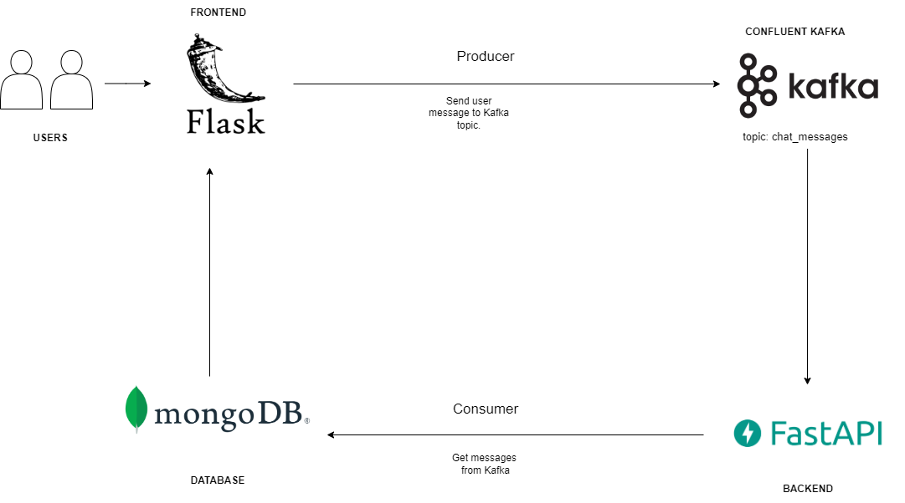
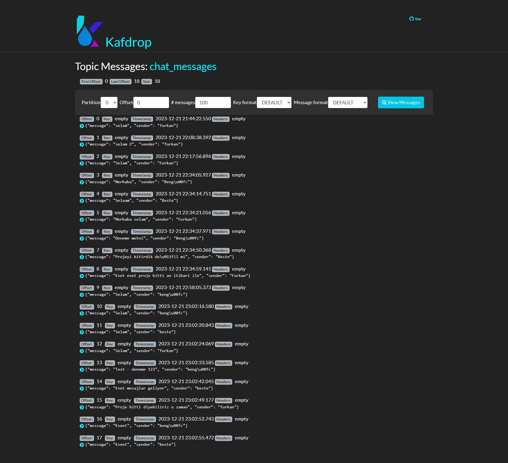
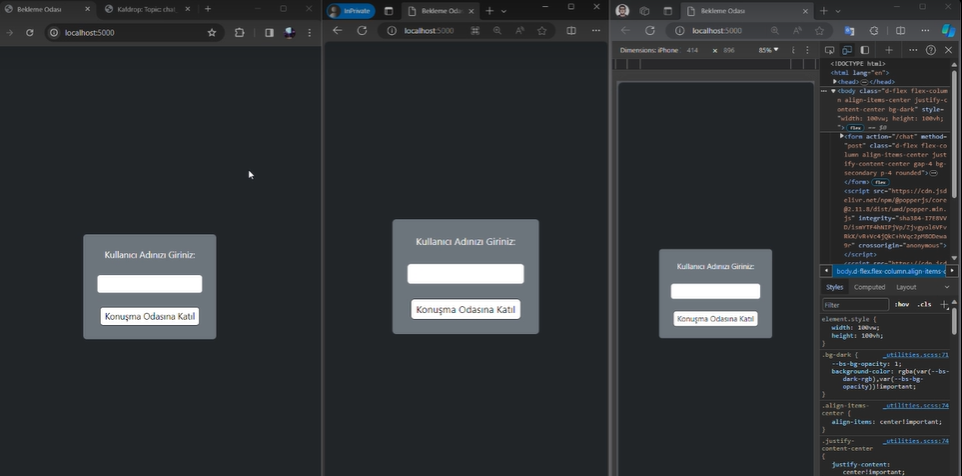
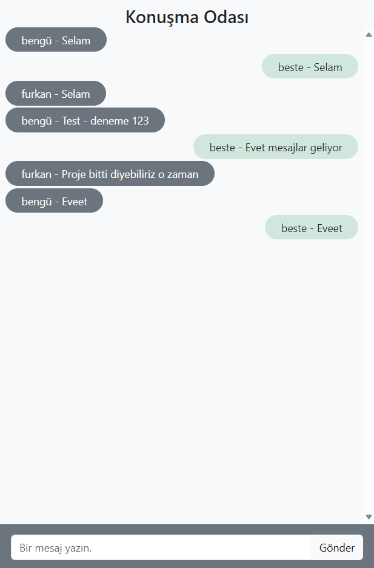
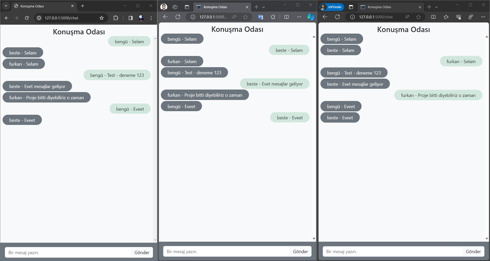

# Flask Chat App Using Confluent Kafka & FastAPI
### Description

In the scope of this project, a basic flask app for front-end is connected to an api using FastAPI for back-end via Confluent Kafka. User enters a username to the flask app's first  page and a message from the following page. This page is a group chat space - n users can be connected, no limitation added for the moment. Then, messages are  sent to Kafka (chat_messages topic) and FastAPI service writes messages directly to Mongo DB database. An addition Kafka topic (named sent_messages) can be added to store messages temporarily in case of a possible problem. The project can be executed on Docker. 

### App Workflow
 

### Install Required Libraries
```bash
# get sudo permission
yum install docker git -y

# start Docker service
systemctl restart docker
```

### Install Docker Compose
If you downloaded Docker Desktop, you already have it (for Windows users)
You can install Docker Compose using the following command:
```bash
sudo curl -L https://github.com/docker/compose/releases/latest/download/docker-compose-$(uname -s)-$(uname -m) -o /usr/local/bin/docker-compose

sudo chmod +x /usr/local/bin/docker-compose

docker-compose version
```

### Execution
Use `--build` flag if you are creating the container for the first time. It makes images to be installed (can be monitored from the Docker Desktop). 
```bash
docker-compose up --build
```

Ports used for this project:

* http://localhost:5000 to access the flask app.
* http://localhost:9000 to access the Kafka UI (Kafdrop).
* http://localhost:8000/docs to access the FastAPI Swagger UI.

### Screenshots

- Kafdrop
  - 
  
- Flask
  -  
  -  

- FastAPI Doc
  - 

- Demo
  - 

---
> **by**
>   
> @furkanerdi
>
> @bestesengul
>
> @benguyurdakul

  
